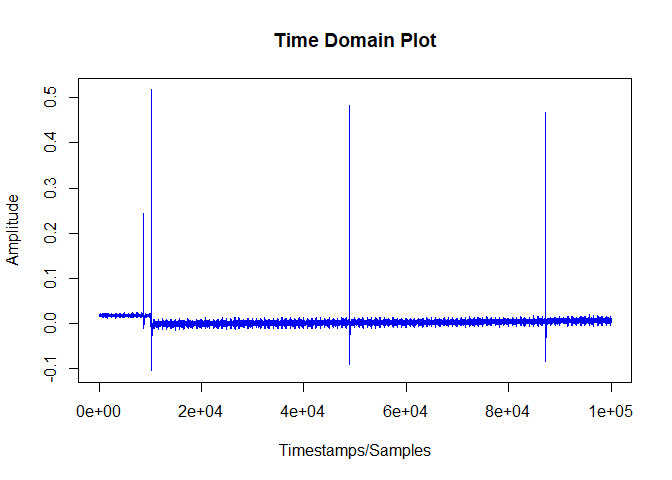

<!-- README.md is generated from README.Rmd. Please edit that file -->

# readTDMS

<!-- badges: start -->
<!-- badges: end -->

The goal of [readTDMS](https://github.com/abhishekhanchate/readTDMS) is
to first of all to read in data stream in an NI TDMS (National
Instruments Technical Data Management Streaming) file format and to test
the use of R for data processing requirements without making any
modifications in the data acquisition procedure. The package provides an
intuitive output in the form of a data stream or a time series. It also
provides means to perform subsequent analyses such as analysis of the
time series data in the time domain, frequency domain, and
time-frequency domain along with important metrics and visual plots.

## Installation

[readTDMS](https://github.com/abhishekhanchate/readTDMS) is designed as
an R package and we can install it from GitHub via:

``` r
# install.packages("devtools")
devtools::install_github("abhishekhanchate/readTDMS", build_vignettes = TRUE)
```

## Potential Windows Installation Errors

Sometimes, the `install_github` function doesn’t work properly on
Windows as it fails to install some of the dependencies. So, you may
have to install them manually. Possible dependencies include the
following:

``` r
install.packages(c('tdmsreader', 'oce', 'signal', 'ggplot2'))
```

Note that this is only a problem on windows, other platforms should
install all dependencies automatically when you use:  
`devtools::install_github('abhishekhanchate/readTDMS')`  
or  
`library(devtools)` `install_github('abhishekhanchate/readTDMS')`

## Example

We demonstrate the functionalities of the package
[readTDMS](https://github.com/abhishekhanchate/readTDMS) in reading and
analyzing data streams coming from a TDMS file. The first step after
installing and importing the library is to read a TDMS file from a given
repository/directory. (Note: The TDMS_Index file associated with the
TDMS file must also be present in the same folder)  
  
Now, by using the `tdmsread()` function, we can read in the required
TDMS file. This function provides us with the extracted data stream in
form of the amplitude values of the data as well as the timestamps
associated with it. We also get a brief summary of the data stream along
with an optional (by default, False) visual into the time domain
illustration.

``` r
library(readTDMS)
#> Loading required package: tdmsreader
## Basic Example Code
f <- file('./vignettes/data/file.tdms', 'rb')
out <- tdmsread(f, plot = TRUE)
```



``` r
head(out$datastream, n = 15)
#>  [1] 0.01800260 0.01964717 0.01668694 0.01833151 0.01701586 0.01767369
#>  [7] 0.01800260 0.01602911 0.01833151 0.01800260 0.01635803 0.01898934
#> [13] 0.01931826 0.01635803 0.01701586
head(out$timestamps, n = 15)
#>  [1] 0.00001 0.00002 0.00003 0.00004 0.00005 0.00006 0.00007 0.00008 0.00009
#> [10] 0.00010 0.00011 0.00012 0.00013 0.00014 0.00015
out$summ
#>       Min.    1st Qu.     Median       Mean    3rd Qu.       Max. 
#> -0.1046824  0.0002412  0.0032015  0.0040188  0.0058328  0.5172946
close(f)
```

For more detailed introduction to the package, please refer
[here](https://github.com/abhishekhanchate/readTDMS/blob/master/vignettes/tdms-vignette.pdf)
for more details.  
  
If you encounter any issue with the package, please feel free to file
and issue.

## Notes

This package only supports a subset of the TDMS spec and has been tested
on single channel 32-bit float data stream.  
  
Feedback is welcomed! Please feel free to raise an issue.

## Credit

This package relies on the initial direct reading functionality on the R
package, [tdmsreader](https://github.com/msuefishlab/tdmsreader), which
in-turn is a port of the Python package,
[npTDMS](https://github.com/adamreeve/npTDMS), into R and shares the
same LGPL license.
