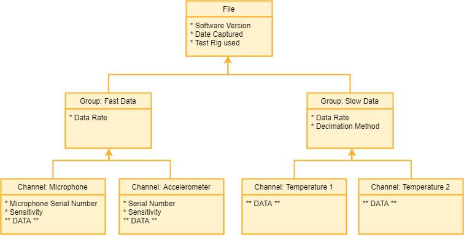

```{r, include = FALSE}
knitr::opts_chunk$set(
  collapse = TRUE,
  comment = "#>"
)
```

## Introduction and Motivation

In this vignette, we go over the [readTDMS](https://github.com/abhishekhanchate/readTDMS) package, an R-based TDMS file format reader and analyzer, which is used for reading an TDMS file and performing subsequent analyses on the extracted data streams from the file. Not a lot of attention or consideration is given to data storage options at forefront of application planning and data storage. Decisions are often made arbitrarily on an as-needed, per-application basis without much thought to reusability, scalability, and recyclability or reproducibility, which leads to tedious and costly software rearchitecture. Given that applications and requirements change over time, even the most popular file storing formats quickly fall short of meeting the demands of engineers and scientists storing time-based measurement data. This is especially common in fields such as smart manufacturing, IoT, and healthcare, wherein large amounts of data is generated without much metadata associated with it. 

## NI TDMS Format

An NI TDMS (National Instruments Technical Data Management Streaming) file format is used for saving well-documented measurement data which is stored in the most efficient, organized, and scalable fashion to disk. For example, a typical TDMS file can store the same amount of data in about one-fourth disk space as compared to that required by an Microsoft Excel file. Given its structured and binary format nature, each type of measurement is stored in its own channel. Every channel belongs to a certain channel group and a given TDMS file can contain several such groups of multiple channels. At each of these levels, I can assign properties which keep a track of the associated metadata. This complex yet useful structure boosts traceability and lets us search for relevant data and track any problems that pop up. Given the binary format storage, TDMS files tend to be fast to read with no loss in precision for a data stream. The figure below gives us an example of a TDMS structure.

\
```{r echo=FALSE, out.width='85%', fig.align="center"}

```
\

Given the fairly complex binary format, these files are often difficult to directly read in R. This package lets us test the use of R for data processing requirements without changing anything with the data acquisition process. Also, having this direct reading process assists in reducing barriers to others trying to use R for such a purpose. The package will have a dependency on [tdmsreader](https://github.com/msuefishlab/tdmsreader) by [msuefishlab](https://github.com/msuefishlab) and contains further analyses and functionalities such as frequency domain visuals as well as time-frequency domain spectral plots. 

## Source Code

https://github.com/abhishekhanchate/readTDMS

## Installation Guide and Troubleshooting

[readTDMS](https://github.com/abhishekhanchate/readTDMS) is designed as an R package and we can install it from GitHub via:

```{r, eval = FALSE}
devtools::install_github("abhishekhanchate/readTDMS")
```

In case of errors, please make sure that you have devtools installed as well. If not, you can install it and then install readTDMS using:

```{r, eval = FALSE}
install.packages('devtools')
devtools::install_github("abhishekhanchate/readTDMS")
```

## Potential Windows Installation Errors

Sometimes, the install\_github function doesn’t work properly on Windows as it fails to install some of the dependencies. So, you may have to install them manually. Possible dependencies include the following:

```{r, eval=FALSE}
install.packages(c('tdmsreader', 'tuneR', 'signal', 'ggplot2'))
```

Note that this is only a problem on windows, other platforms should install all dependencies automatically when you use:
\
`devtools::install_github('abhishekhanchate/readTDMS')` 
\
or
\
`install_github('abhishekhanchate/readTDMS')`

## Using readTDMS

Once the package has been installed, you can run it by running:

```{r setup}
library(readTDMS)
```

## Example Use-case

We demonstrate the functionalities of the package [readTDMS](https://github.com/abhishekhanchate/readTDMS) in reading and analyzing data streams coming from a TDMS file. The first step after installing and importing the library is to read a TDMS file from a given repository/directory. (Note: The TDMS_Index file associated with the TDMS file must also be present in the same folder)

```{r}
f <- file('./data/file.tdms', 'rb')
```

Now, by using the tdmsread() function, we can read in the required TDMS file. This function provides us with the extracted data stream in form of the amplitude values of the data as well as the timestamps associated with it. We also get a brief summary of the data stream along with an optional (by default, False) visual into the time domain illustration.

```{r, fig.width=6, fig.height=4, fig.align="center"}
out <- tdmsread(f, plot = TRUE)
head(out$datastream, n = 50)
head(out$timestamps, n = 50)
out$summ
close(f)
```

The Time domain visual helps us look into the original data stream measurements. We can visually analyze various spikes associated with the data stream.
\
\
After this, we can look into the Frequency domain features. The readTDMS package has two functions, namely datafreq() and fftprofile(), for this purpose. With the former, we can visually look at the frequency domain plot of the data stream along with its frequency components and associated frequencies. While with the latter, we can get more into the details of frequency components and extract the desired number of top peaks associated with the frequency domain of the data stream.

```{r, fig.width=6, fig.height=4, fig.align="center"}
f <- file('./data/file.tdms', 'rb')
freq_out <- datafreq(f, frequencyPoints = 10000, xlim1 = 0, xlim2 = 10000, ylim1 = -10, ylim2 = 600)
head(freq_out$freq_comps, n = 50)
head(freq_out$frequency, n = 50)
close(f)
```
The top frequency components can then be extracted as below:
```{r, fig.width=4, fig.height=2, fig.align="center"}
f <- file('./data/file.tdms', 'rb')
top_freq <- fftprofile(f, frequencyPoints = 10000, n = 25) # Top 25 Frequencies
top_freq
close(f)
```

Similarly, we can get into the Time-frequency domain features associated with the data stream. However, it is usually advisable to first demean your data stream to get rid of any unwanted trend associated with it. We do so as illustrated by example below:

```{r, fig.width=4, fig.height=2, fig.align="center"}
f <- file('./data/file.tdms', 'rb')
out <- tdmsread(f, plot = FALSE)
data <- out$datastream
data_demeaned <- demeaner(data)
mean(data)
mean(data_demeaned)
close(f)
```
It is clear from the above mean values that we have accomplished what we wanted to do. Now, we can work on extracting the desired Time-frequency domain features.

```{r, fig.width=4, fig.height=3, fig.align="center"}
f <- file('./data/file.tdms', 'rb')
out <- tdmsread(f, plot = FALSE)
data <- out$datastream
time_freq_out <- spectro(x = data, n = 1024, Fs = 1000, window = 256, overlap = 128)
time_freq_out$freq_comps[1:5, 1:5]
head(time_freq_out$timestamps, n = 5)
head(time_freq_out$frequencystamps, n = 5)
close(f)
```

## Conclusion

The [readTDMS](https://github.com/abhishekhanchate/readTDMS) package offers a streamlined approach to reading and analyzing any given TDMS file. You have a direct read functionality in R along with access to several spectral analyses techniques such as FFT and Spectrograms. You can also create any desired plots with a variety of changeable parameters and get summary statistics. 


## Notes

This package only supports a subset of the TDMS spec and has been tested on single channel 32-bit float data stream. 
\
\
Feedback is welcomed!


## Credit

This package relies on the initial direct reading functionality on the R package, [tdmsreader](https://github.com/msuefishlab/tdmsreader), which in-turn is a port of the Python package, [npTDMS](https://github.com/adamreeve/npTDMS), into R and shares the same LGPL license.


